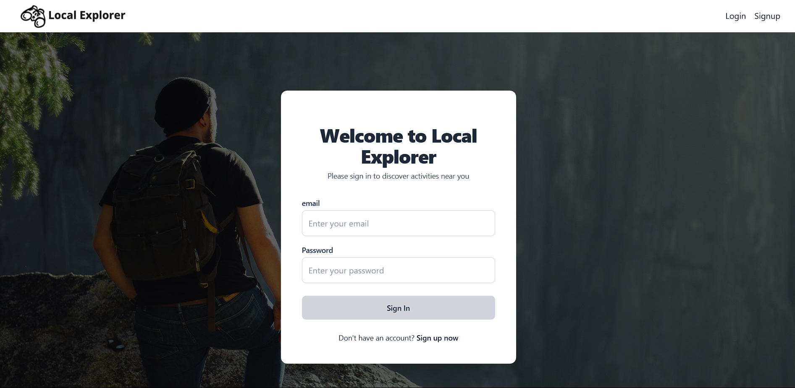
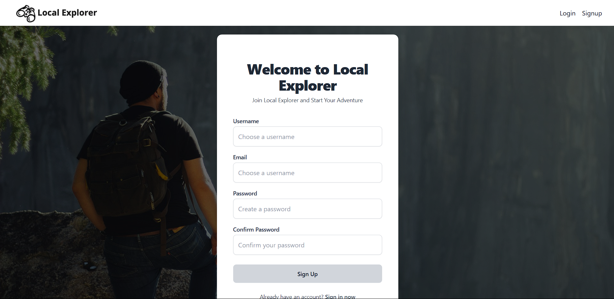
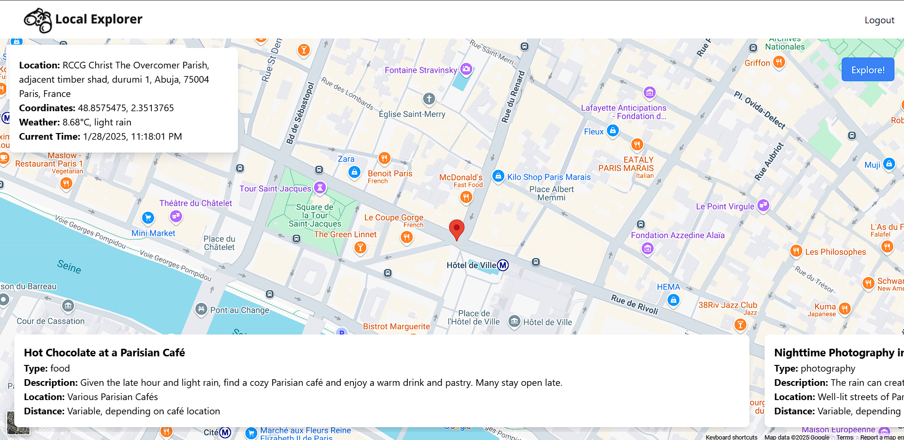

# Local Explorer

A smart activity suggestion app that uses AI to suggest activities based on location, weather, and time of day.

## Table of Contents

* [About](#about)
* [Features](#features)
* [Screenshots](#screenshots)
* [Installation](#installation)
* [Usage](#usage)
* [API](#api)
* [TODO](#todo)

## About

Local Explorer uses the Gemini1.5-flash AI model, Google Maps API, and OpenWeather API to suggest activities based on your location, the current weather, and the time of day.

## Features

* Get activity suggestions based on your location, the current weather, and the time of day
* View suggestions on a map
* View detailed information about each suggestion

## Screenshots

## Installation

### Backend

1. Clone the repository: `git clone https://github.com/micahstern/local-explorer.git`
2. Move into the backend directory: `cd backend`
3. Install dependencies: `npm install`
4. Start the server: `npm run dev`
5. Open the app in your browser: `http://localhost:3001`

### Frontend

1. Clone the repository: `git clone https://github.com/micahstern/local-explorer.git`
2. Move into the frontend directory: `cd frontend`
3. Install dependencies: `npm install`
4. Start the app: `npm start`
5. Open the app in your browser: `http://localhost:3000`

## Usage

1. Create an account
2. click the button "Let's Explore!"
3. View suggestions on the map

## API

Local Explorer uses the following APIs:

* [Gemini1.5-flash](https://github.com/google/generative-ai): a smart AI model that suggests activities based on location, weather, and time of day
* [Google Maps API](https://developers.google.com/maps/): a mapping API that provides location-based information
* [OpenWeather API](https://openweathermap.org/api): a weather API that provides current weather information

## TODO

* Add the ability to filter activities by type and categories
* Add the ability to favorite suggestions
* Add the ability to get walking directions to each suggestion
* Add the ability to share suggestions with friends